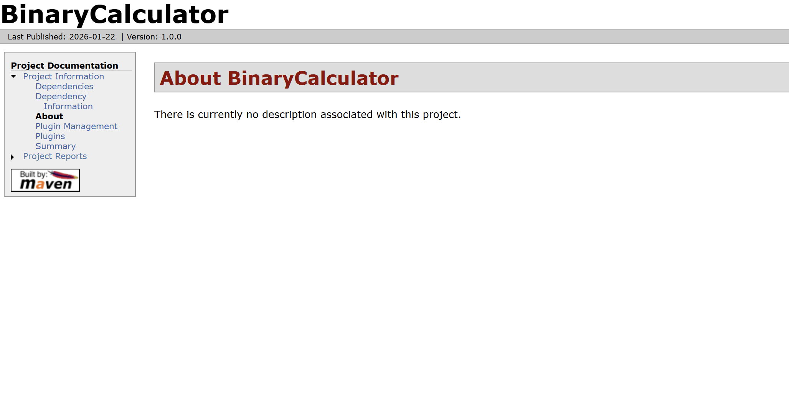
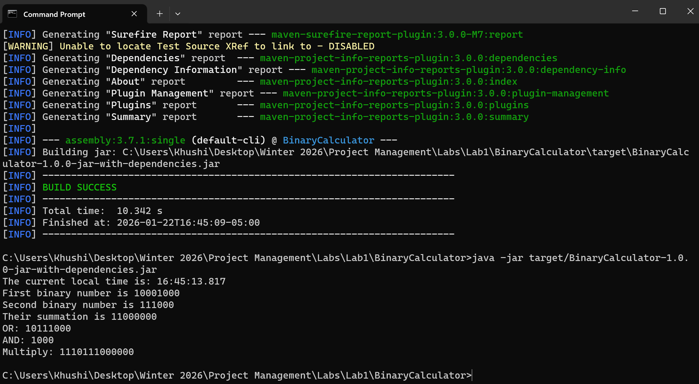
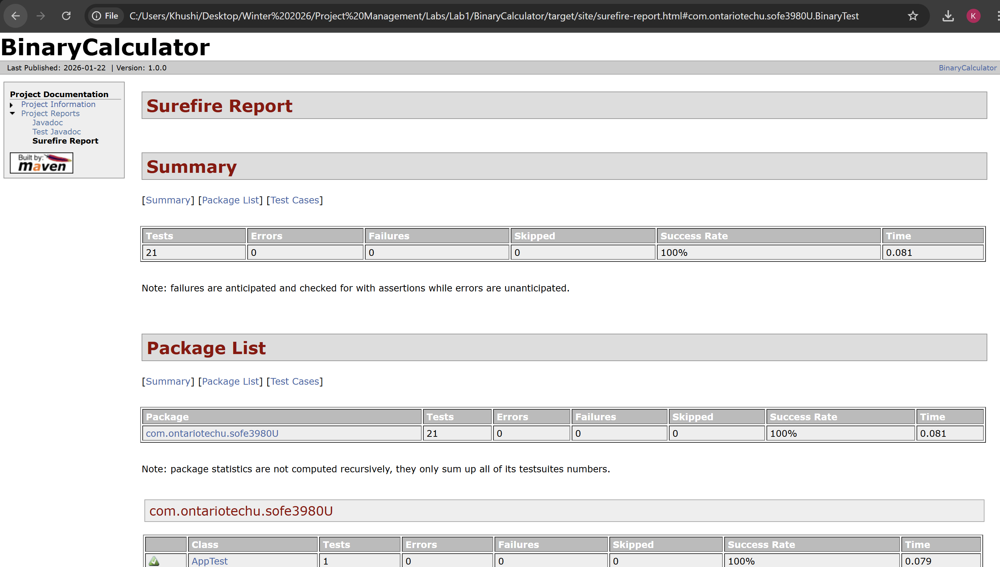
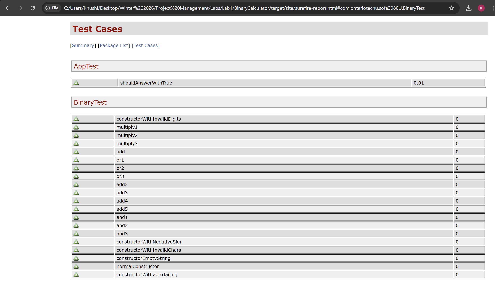

# Binary Calculator – Lab 1

## 📌 Course Information
- **Course:** SOFE 3980U – Software Quality & Project Management
- **Lab:** Lab 1 – Design and Testing
- **CRN:** 75766
- **Student Name:** Khushi
- **Student ID:** 100940709
- **Term:** Winter 2026

## 📖 Project Description
This project implements an unsigned binary number calculator using Java and Maven.  
The `Binary` class supports basic binary operations including:

- Binary addition
- Bitwise OR
- Bitwise AND
- Binary multiplication

JUnit test cases are provided to validate the correctness of all implemented operations.  
Screenshots have been added to demonstrate the successful execution of all implemented test cases and Maven build phases.

## 🛠️ Technologies Used
- **Java JDK:** 21
- **Build Tool:** Apache Maven
- **Testing Framework:** JUnit 4
- **IDE:** Visual Studio Code


## 📂 Project Structure
```
BinaryCalculator/
├── src/
│ ├── main/java/com/ontariotechu/sofe3980U/
│ │ ├── App.java
│ │ └── Binary.java
│ └── test/java/com/ontariotechu/sofe3980U/
│ └── BinaryTest.java
├── pom.xml
├── README.md
└── .gitignore
```

## ⚙️ How to Build the Project
Make sure Java and Maven are installed.

From the project root directory, run:
```
mvn clean package
```

## ▶️ How to run the project

After a successful build:
```
java -jar target/BinaryCalculator-1.0.0-jar-with-dependencies.jar
```

The program will:
1. Display the current time
2. Create two binary numbers
3. Show results for:
    - Addition  
    - OR
    - AND
    - Multiplication

## 🧪 Running Tests

To execute all the unit tests:

```
mvn test
```

All tests should pass successfully.

### 📄 Where to find them

**Surefire Test Report (HTML):**
```
target/site/surefire-report.html
```

```
mvn surefire-report:report
```

**Open the following file in a browser:**
```
target/site/surefire-report.html
```

This report lists:
- All test cases executed
- Passed/failed status
- Test class and method names

> Note: The `target/` directory is excluded from GitHub as required.
> Test reports can be regenerated locally by running the commands above.

## ✨ Implemented Functions

The following functions were added to the `Binary` class:
- `or(Binary b1, Binary b2)`
- `and(Binary b1, Binary b2)`
- `multiply(Binary b1, Binary b2)`

Each function includes at least three test cases in `BinaryTest.java`.

## 📄 Documentation

JavaDoc comments are included for all newly added methods.  
Documentation can be generated using:

```
mvn javadoc:javadoc
```

## 🎥 Demo Video
You can find my demo video at: [Lab_1 Demo Video](https://drive.google.com/file/d/1O6c5FyR3kU6cld12ptz62i89ktk1mrb0/view?usp=sharing)

## 📸 Screenshots
The following screenshots demonstrate the successful execution of the project and test cases.

### Binary Calculator Dashboard


### Function Output in Terminal


### Surefire report

